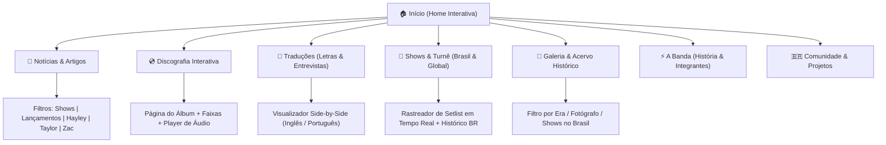

# Diagnóstico & Roadmap de Redesenho: Paramore Brasil

> **Relatório Técnico e Proposta de Arquitetura de Informação**  
> Alvo: Modernização de [paramore.com.br](https://www.paramore.com.br/)  
> Versão: 2.0.0

---

## 1. Auditoria e Diagnóstico do Site Atual

A partir da análise estrutural do site atual (`paramore.com.br`), identificamos pontos fortes do acervo histórico e grandes oportunidades de evolução técnica e visual:

```
[ SITE ATUAL: Diagnóstico ]
--------------------------------------------------------------------------------------
Tema / Engine      : WordPress com tema genérico ("Creativ Musician")
Paleta Atual       : Rosa genérico (#ff0078) — sem conexão histórica com as eras da banda
Tipografia Atual   : Open Sans + Montserrat + Ícones FontAwesome 4.7.0
Estrutura de Layout: Coluna principal + Sidebar pesada com widgets legados (Jetpack, etc.)
Experiência Mobile : Funcional, mas densa e com tempo de carregamento prejudicado por scripts
Recursos para Fãs  : Conteúdo riquíssimo em texto, porém estático (sem interatividade)
--------------------------------------------------------------------------------------
```

### Principais Gargalos Identificados
1. **Identidade Visual Desconectada:** O uso do rosa `#ff0078` como cor primária de botões e links dá uma aparência de template pré-moldado, deixando de lado as ricas paletas do Paramore (*Laranja Riot, Amarelo BNE, Terracota This Is Why*).
2. **Falta de Ferramentas Exclusivas para Fãs:** O acervo de traduções e discografia existe em formato de posts convencionais de blog, dificultando a busca rápida de uma letra com tradução simultânea.
3. **Performance e Carregamento:** O excesso de arquivos legados de fontes e CSS de temas antigos afeta o Core Web Vitals, especialmente em 4G/5G durante cobertura de eventos.

---

## 2. Proposta de Nova Arquitetura de Informação (IA)

A nova estrutura foi planejada para atender tanto o fã casual que quer ler notícias rápidas quanto o fã veterano que busca o acervo histórico:



---

## 3. As Novas Funcionalidades Exclusivas

### 1. Seletor Dinâmico de Era ("Era Switcher")
Permite ao visitante mudar a skin de todo o portal com 1 clique no menu superior, customizando cores, tipografia de destaque e elementos gráficos de acordo com seu álbum favorito.

### 2. Hub de Letras & Tradução Simultânea (Side-by-Side Lyrics)
- Letra original sincronizada com a tradução em português.
- Notas explicativas da equipe do fã-clube contextualizando metáforas e referências de cada estrofe.
- Player de áudio embutido para ouvir enquanto lê.

### 3. Central de Shows no Brasil ("Paramore in Brazil Hub")
- Histórico completo de todas as passagens da banda pelo país (2008, 2011, 2013, 2014, 2023).
- Galeria de ingressos clássicos, vídeos, setlists e relatos de fãs que subiram no palco para cantar *"Misery Business"*.
- Contagem regressiva e informações práticas para futuras turnês (preços, classificação, setorização, dicas de transporte).

### 4. Cobertura Ao Vivo Dinâmica ("Live Mode")
Em dias de show, a página inicial ganha uma barra de alerta superior no estilo *Live Blogging*, atualizando a setlist e fotos em tempo real sem necessidade de recarregar a página (*Server-Sent Events / WebSockets*).

---

## 4. Sugestão de Stack Tecnológica Recomendada

Para garantir velocidade instantânea, SEO excelente e facilidade de manutenção para a equipe:

| Camada | Tecnologia Sugerida | Benefício para o Fã-Clube |
| :--- | :--- | :--- |
| **Framework Web** | **Next.js 15 (App Router)** ou **Astro 5.0** | Velocidade instantânea, renderização híbrida estática/SSR, SEO nota 100. |
| **Estilização** | **Tailwind CSS + CSS Variables** | Fácil manutenção do Design System e troca dinâmica de temas por era. |
| **CMS / Conteúdo** | **WordPress REST API** (Headless) ou **Sanity.io** | Permite manter todo o banco de dados de 20 anos de matérias do WordPress existente, desacoplando apenas o front-end! |
| **Hospedagem & CDN** | **Vercel** ou **Cloudflare Pages** | Gratuito ou de baixíssimo custo para fã-clubes, com CDN global e carregamento em milissegundos no Brasil. |
| **Mídia e Galeria** | **Cloudinary** ou **UploadThing** | Otimização automática de imagens WebP/AVIF para carregar galerias pesadas sem travar o celular. |

---

## 5. Fases do Roadmap de Execução

```
[ FASE 1: Fundações ]
  - Aprovação das Diretrizes de Identidade Visual e Design Tokens
  - Configuração do repositório front-end com Tailwind + Temas das Eras
  - Criação da biblioteca base de componentes de UI

[ FASE 2: Conexão de Dados & Acervo ]
  - Integração com a API do WordPress existente para resgatar notícias e categorias
  - Estruturação do banco de dados da Discografia e Letras Traduzidas
  - Implementação do visualizador de tradução lado a lado

[ FASE 3: Recursos de Fã & Mídia ]
  - Criação do Hub de Shows no Brasil e Rastreador de Setlist
  - Construção da Galeria de Fotos com filtros por Era
  - Testes de Acessibilidade (WCAG) e Otimização Mobile

[ FASE 4: Lançamento & Comunidade ]
  - Beta fechado com moderadores e colaboradores do Paramore Brasil
  - Lançamento oficial comemorativo com campanha nas redes sociais
```
